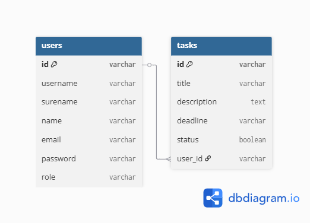

# Todo App (Backend)

Bu loyihada foydalanuvchilar (users) va vazifalar (tasks) bilan ishlash uchun backend API yozilgan.  
Texnologiyalar: **Node.js, Express, PostgreSQL, JWT, bcrypt, nanoid**

---

postmanda test ushun havola : "https://documenter.getpostman.com/view/45878072/2sB3QFQsHu"

## 📌 Database Diagram



---

## 🚀 API Endpoints

### Auth
- `POST /auth/signup` – yangi foydalanuvchi qo‘shish
- `POST /auth/login` – tizimga kirish
- `GET /auth/users` – barcha foydalanuvchilar (faqat admin)

### Tasks
- `POST /tasks` – yangi task qo‘shish
- `GET /tasks` – barcha tasklarni olish
- `GET /tasks/:id` – bitta taskni olish
- `PUT /tasks/:id` – taskni yangilash
- `DELETE /tasks/:id` – taskni o‘chirish

---

## 🛠 Ishga tushirish

```bash
git clone <repo-link>
cd backend-todo-app
npm install
npm run dev


